<!-- _class: lead -->
# Metaorders, Price Impact, and Crowding
## Proprietary vs client aggressive flow (CONSOB trades)

**Metaorders\_PriceImpact (artifact snapshot: Dec 2025)**  
**Date:** Feb 2026

---

## Motivation

- Large trades are executed as many child trades (“metaorders”) and can move prices.
- Impact matters for execution costs, liquidity measurement, and market stability.
- If many agents trade in the same direction (“crowding”), impact can amplify.
- We split aggressive flow into **proprietary** vs **client** to study heterogeneity and co-impact.

---

## Context

- Concave (often square-root-like) impact across markets: Bouchaud, Farmer & Lillo (2008).
- Log/participation-rate refinements for metaorder impact: Zarinelli et al. (2015).
- Crowding / co-impact in institutional trading: Bucci et al. (2020).

<!--
References are taken from the repository paper bibliography (no new citations introduced here).
-->

---

## Research questions

1. **Concavity:** does impact scale as a power law in size, or is a log form competitive?
2. **Heterogeneity:** how do impact curves differ for proprietary vs client aggressive flow?
3. **Crowding:** do metaorders align with (or oppose) signed volume imbalance?
4. **Member–client interaction:** does a member’s proprietary flow align or go against with its clients’ imbalance?

---

## Data & segmentation

- Trade-by-trade dataset with instrument, timestamp, aggressor label, participants identifiers (broker and client) and trade source intent (proprietary/non proprietary)
- Continuous session only (no opening and closing auctions): **09:30–17:30**.
- Two groups (aggressive flow):
  - **Proprietary:** member dealing on own account.
  - **Client:** member dealing for its clients.

  

    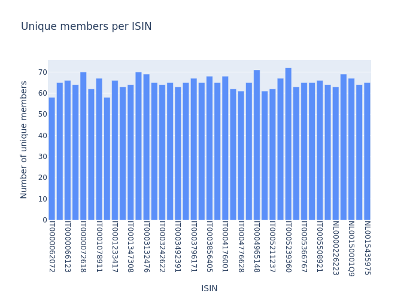
  

  

    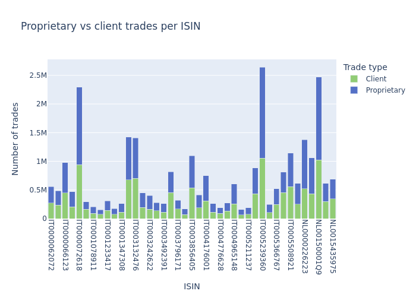
  

---

## Metaorder reconstruction (definition)

For a fixed instrument $k$, day $d$, and agent $a$:

- A **metaorder** is a **contiguous run** of aggressive trades with constant sign $\varepsilon \in \{+1,-1\}$.
- Split a run if an inactivity gap exceeds **1 hour**.
- Keep only runs with at least **5** trades and duration at least **120 s**.
- Enforce “single-day” and “single-client-id” consistency within a run.

---

## Variables & normalization

For metaorder $i$ (on day $d(i)$):

$$
Q_i = \sum_{j \in \mathcal{M}_i} q_j,
\qquad
\phi_i = \frac{Q_i}{V_{d(i)}} \;\; (\text{relative size})
$$

$$
\Delta p_i = \log P_i^{\text{end}} - \log P_i^{\text{start}},
\qquad
I_i = \frac{\varepsilon_i \Delta p_i}{\sigma_{d(i)}} \;\; (\text{impact in vol units})
$$

- participation rate
$$\eta_i = Q_i / V_i^{\text{during}}$$ 
where $V_i^{\text{during}}$ is volume in the execution window

---

## Impact models & estimation

- Baseline curve:
  $$
  \mathbb{E}[I \mid \phi] = Y\,\phi^{\gamma}
  \qquad (0<\gamma<1 \Rightarrow \text{concave impact})
  $$
- Estimation strategy:
  - log-bin $\phi$, compute bin means and SEM
  - fit **weighted least squares** in log space (weights $\propto 1/\mathrm{SEM}^2$)
- Comparator: logarithmic form fitted on the same bins.
- Extension: bivariate “impact surface” in $(\phi, \eta)$.

---

## Impact results (Dec 19, 2025 snapshot)

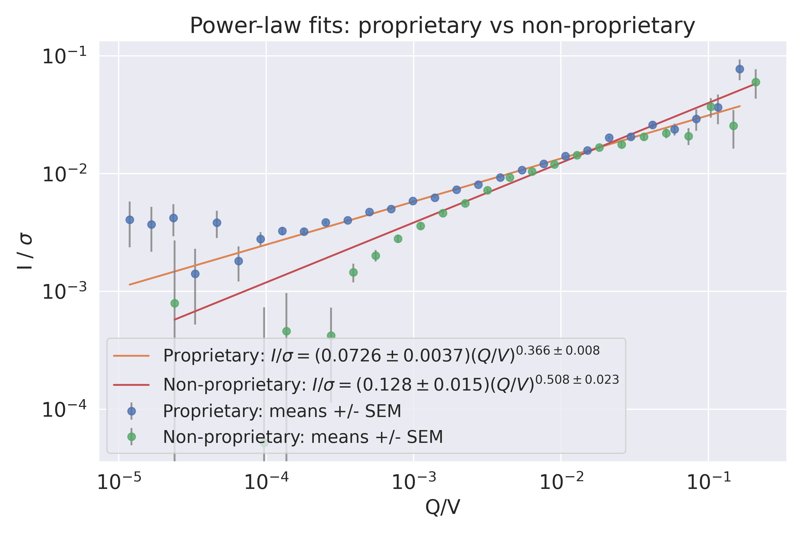

- **Estimated power-law exponents** (after participation-rate filter):
  - Proprietary: $\gamma = 0.366 \pm 0.008$
  - Client: $\gamma = 0.508 \pm 0.023$
- Takeaway: both are concave; **client impact is closer to square-root-like scaling** in this snapshot.

---

## Impact surface: size × participation

| Proprietary | Client |
|---|---|
| 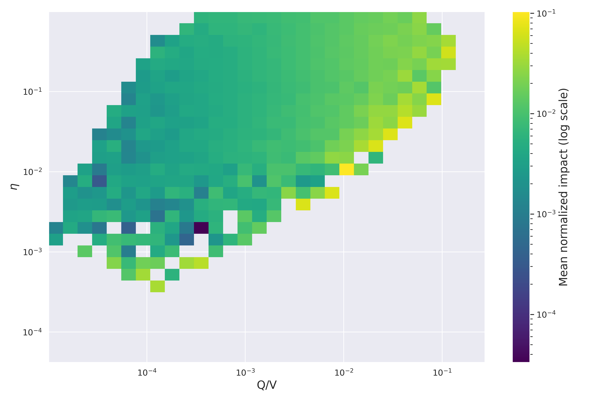 | 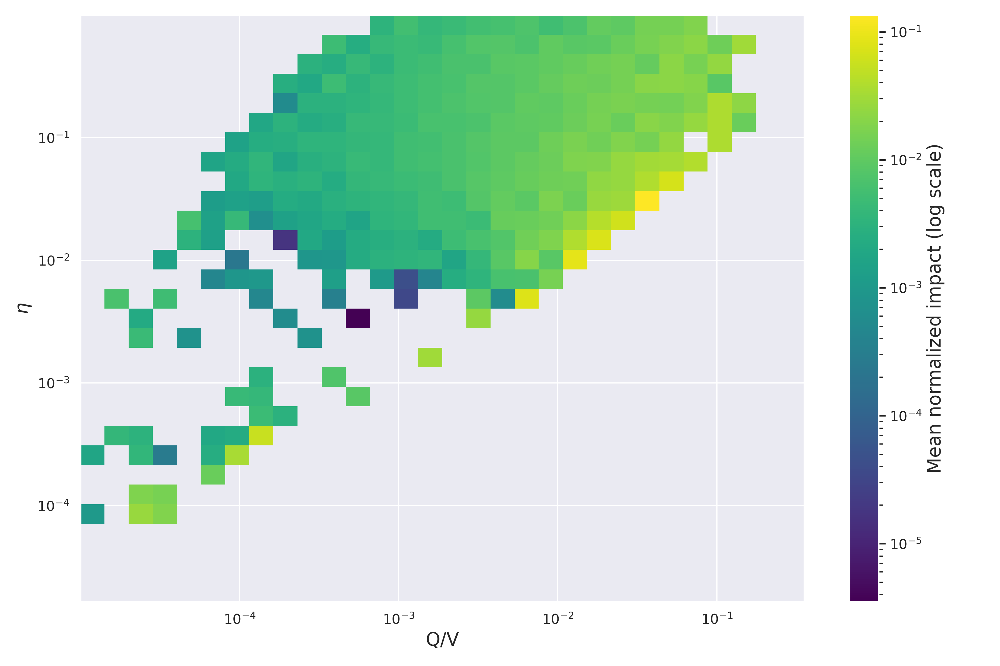 |

- The surface summarizes how mean impact varies jointly with relative size $\phi$ and participation $\eta$.
- Takeaway: conditioning on participation can change the apparent scaling seen in 1D curves.

---

## Time-resolved impact: during execution + aftermath

| Proprietary | Client |
|---|---|
| 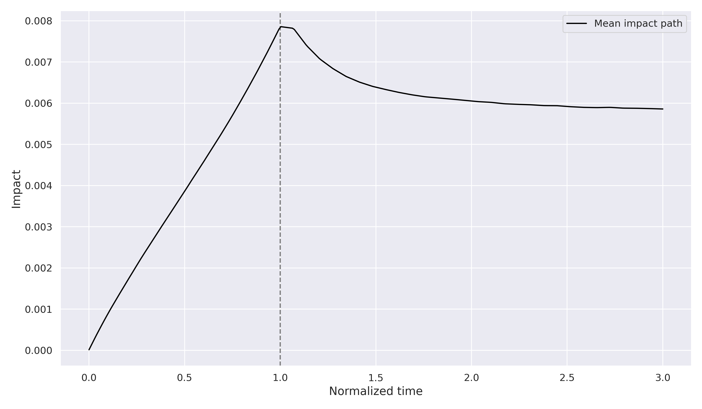 | 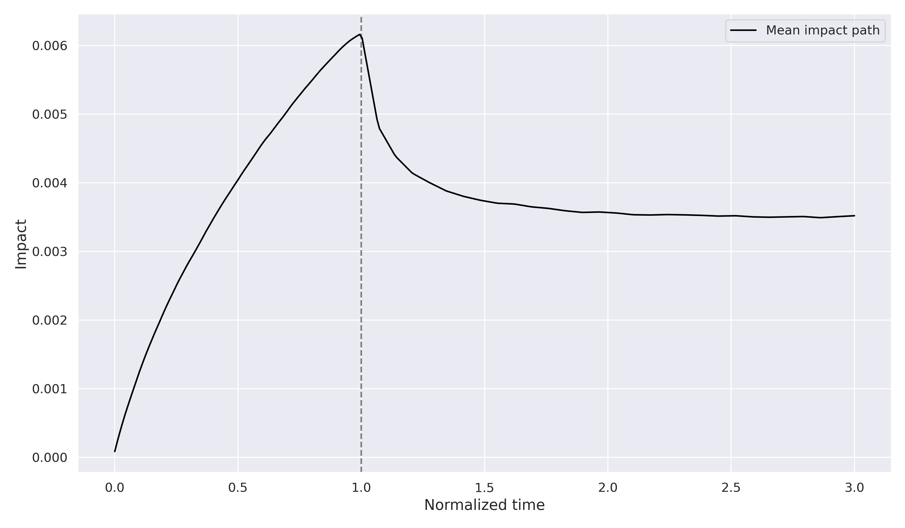 |

- Average normalized trajectories quantify impact build-up during execution and the post-trade evolution.

---

## Crowding / imbalance definitions

For a set of metaorders $\mathcal{S}$:

$$
\mathrm{imbalance}(\mathcal{S})
=
\frac{\sum_{j \in \mathcal{S}} Q_j \varepsilon_j}{\sum_{j \in \mathcal{S}} Q_j}
$$

We study correlations between direction and imbalance, e.g.
$$
r = \mathrm{Corr}(\varepsilon_i,\ \mathrm{imbalance}_i).
$$

Key design choice:

- **Local within-group imbalance** excludes metaorder $i$ itself (avoids trivial self-contribution, but can introduce mechanical bias).

---

## Within-group crowding over time (Dec 17, 2025 snapshot)

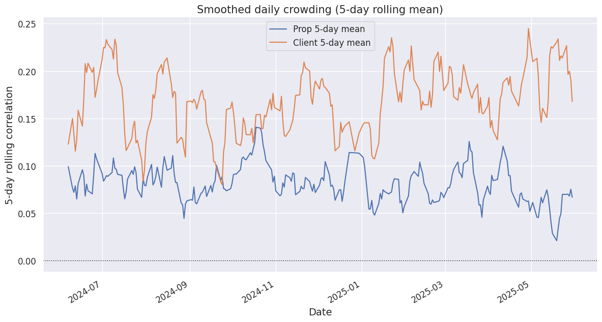

- Daily $r_d = \mathrm{Corr}(\varepsilon_i,\ \mathrm{imbalance}^{\text{local}}_i \mid \text{Date}=d)$, smoothed (5-day).
- Mean daily correlation over days with $n \ge 100$ metaorders:
  - Proprietary: **0.081**
  - Client: **0.168**
- Takeaway: positive within-group alignment, **stronger on the client side** in this snapshot.

---

## Cross-group and “all others” crowding (Dec 17, 2025 snapshot)

| Cross-group | Versus all others |
|---|---|
| 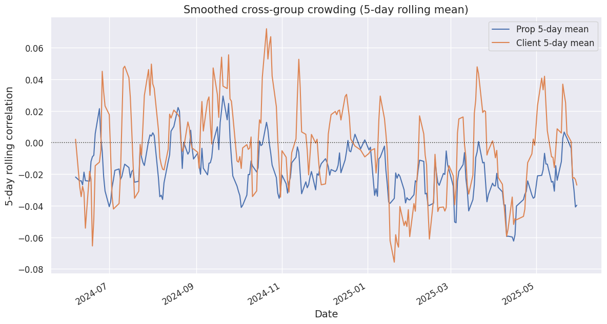 | 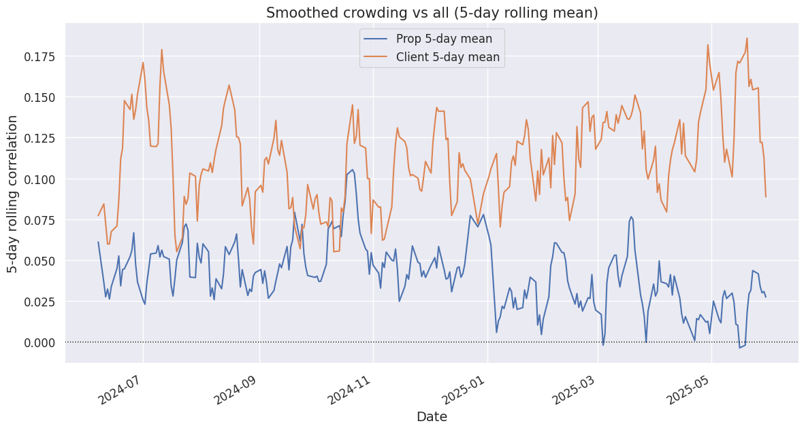 |

- Mean daily correlations over days with $n \ge 100$ metaorders:
  - Cross-group: prop$\mid$client **-0.018**, client$\mid$prop **-0.003**
  - All-vs-all: prop$\mid$all **0.041**, client$\mid$all **0.112**
- Takeaway: cross-group alignment is near zero on average; alignment with the overall environment is modestly positive.

---

## Member-level prop–client crowding (latest run)

| Per-member correlations | Member × window heatmap |
|---|---|
| 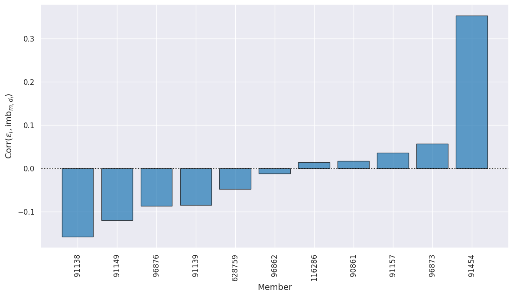 | 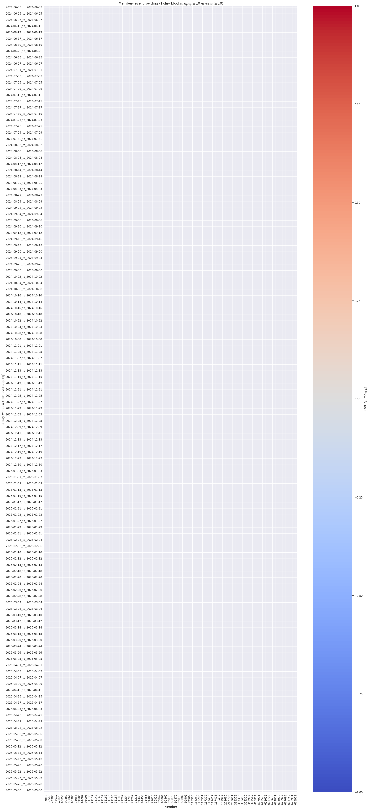 |

- Global member-level correlation (prop direction vs same-member client imbalance):
  - $r \approx 0.014$ (95% CI ≈ [0.003, 0.024]), $n \approx 35{,}695$ metaorders.
- Takeaway: most members/windows are near zero; a small number show episodic alignment or opposition.

---

## Limitations / caveats

- Raw trades are proprietary; results shown are from a **committed artifact snapshot** (FTSE MIB, Dec 2025).
- Metaorder definition depends on thresholds (gap, min trades, min duration) and normalization choices.
- Local self-exclusion avoids trivial self-correlation but can induce mechanical biases (interpret sign carefully).
- Bootstrap/permutation inference is stochastic unless the RNG seed is fixed.
- Correlations capture linear alignment; effects may be nonlinear or regime-dependent.

---

## Conclusions & next steps

- Impact is concave in size and **differs by trading capacity** (prop vs client exponents).
- Crowding is stronger **within** groups than **across** groups on average; member-level prop–client alignment is weak overall.
- Next steps:
  - robustness across normalization modes and thresholds,
  - participation-conditioned exponents and surfaces,
  - state dependence (volatility, time-of-day) and links to returns/volatility,
  - formal co-impact models for multi-agent interaction.

---

## Appendix: imbalance distributions (diagnostic)

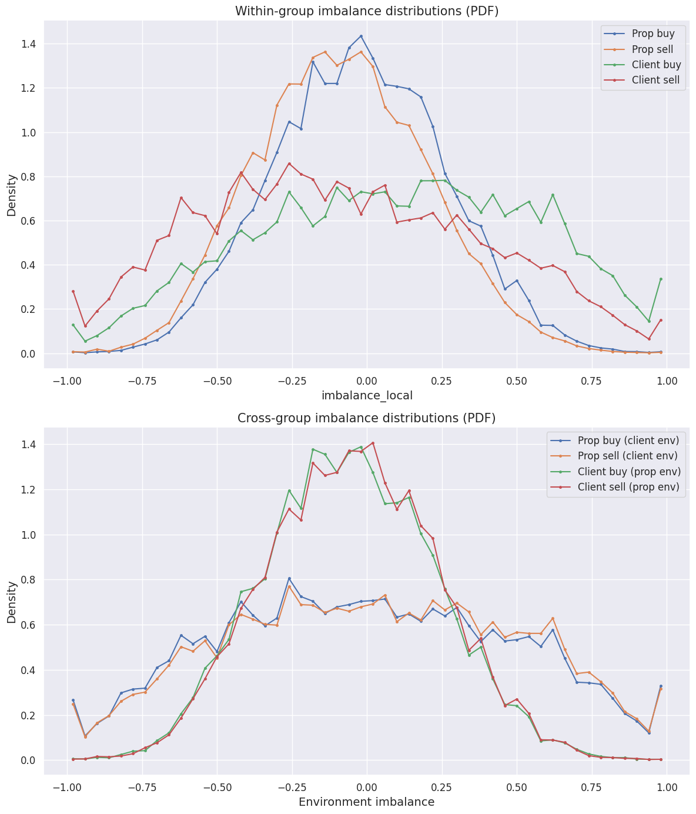

- Empirical distributions of imbalance measures used in the crowding correlations.
- Diagnostic use: check centering, dispersion, and tail mass before interpreting $r$.
